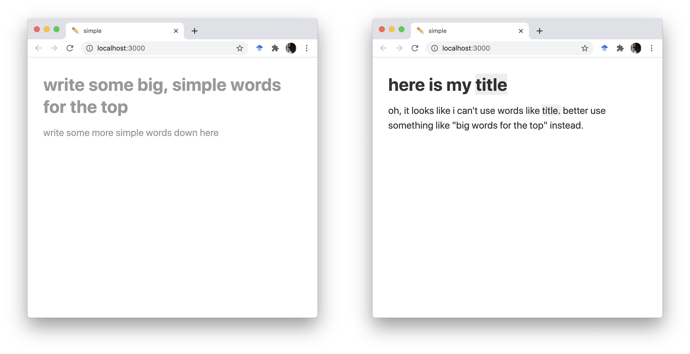

# simple ✏️



## what

write simply, by only using ten-hundred simple words

## why

i thought about doing this because of [the drawing guy](https://xkcd.com/)'s [drawing about up-goers](https://xkcd.com/1133/).

i like the idea that if you can't explain something really simply, you don't really understand it. this is a very stupid way of making that happen.

cutting the words you can use to only the ten-hundred most-used words in your language really makes you think about an idea and the way you explain it. this page does the cutting for you.

the page also stops you from writing too many words. the normal setting only lets you write ten big words and ten-hundred small words. also you can't use big letters, but you can still use all the little pictures/shapes/points/lines.

## how

the page is written with [act-because-of](https://reactjs.org/) and [special-piece-which-goes-faster-than-light-and-makes-time-go-strange](https://tachyons.io/).

because i stole the little set of words i use from [the drawing guy's own page](https://xkcd.com/simplewriter/), this will only work in my own language for now. i might add more later - you can [open a pull-ask](https://github.com/harrisonpim/simple/pulls) if you want to help.

## running this

you can get all the stuff you need to run this page on your machine by writing

```
make get-stuff
```

and then run the page by writing

```
make run
```
